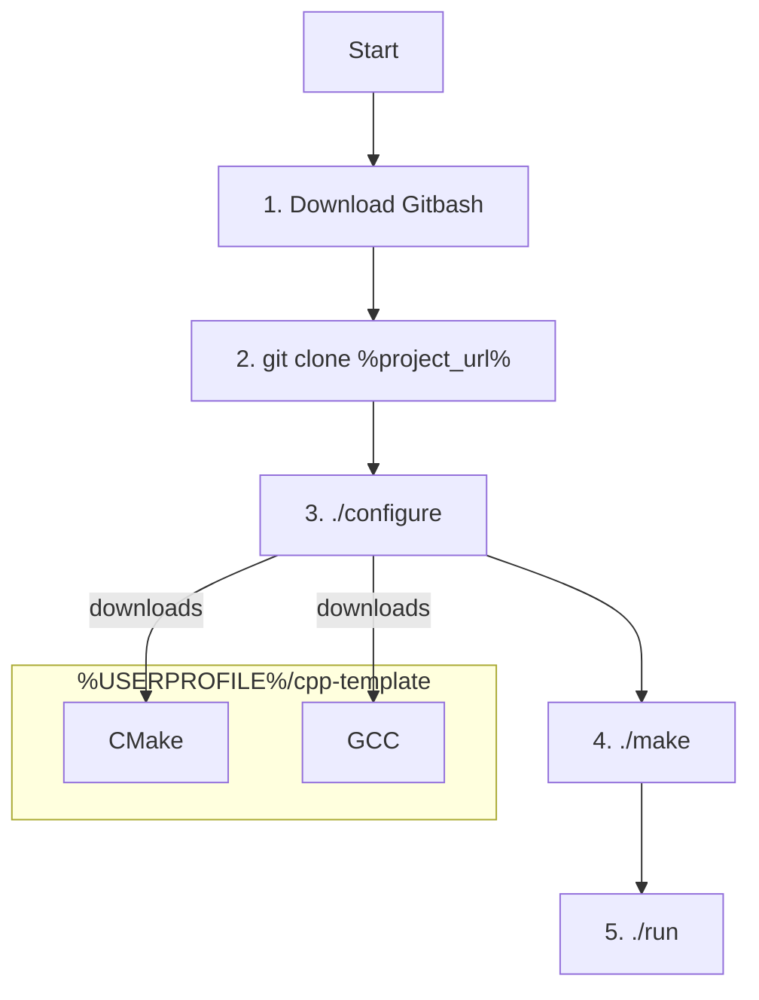

# CPP Template

This is a cpp template project

A visual summary of this guide:

## Getting Started

These instructions will guide you through setting up and configuring the project on your local machine for development and testing purposes.

### Prerequisites

- Ensure you have Git installed on your system (download from here: https://www.git-scm.com/download/win)

### Configuring the basic development dependencies

Clone the repository to your local machine.
In your Git Bash window, change into the project directory.
Configure the project by running this command:

	./configure

- ./ is the the bash version of executing a file.
- configure is the name of the file within the project's root directory that is getting executed.
- This script checks for dependencies and sets up the necessary configuration files for compiling and installing the software.

### Compiling and Building the project

After you have configured your project, you'll need to compile the necessary cpp project. Compile and build the project bun running this command:

	./make
	
### Compiling and Building the project

After you have compiled and built the project, you can run the project running this command:

	./run

### Running Tests

TODO: Explain how to run tests for this system.

## Cleaning Up

If you wish to clean all items configured by the ./configure or ./make script, you can perform a clean operation. This is useful for resetting the machines state to its initial state:

	./configure clean
	./make clean

This command will remove any files or configurations that were set up during the `./configure` and `./make` process, allowing you to start fresh.

## How to develop and Modify Files
- This template uses CMake which is mostly controlled by CMakeLists.txt at the root directory.
- If you read this CmakeLists.txt file, you'll notice this line

	add_subdirectory(source/cpp)
	
- This line tells CMake that it should look for another CMakeLists.txt in the source/cpp directory, but this can be any path you want.
- If you read the source/cpp/CmakeLists.txt, you'll notice that there's files and directory paths called out. These are included into the compiled executable during run!
- You may include directories by adding more add_subdirectories within any of the CMakeLists.txt
