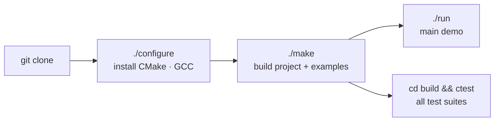

# cpp-config-ini

A C++20 library for type-safe, schema-driven INI configuration files with CLI override support, validation rules, and schema migration.

## Features

- **Type-safe access** — compile-time enforcement via C++20 concepts; `getValue<T>()` returns the exact type you declared
- **INI persistence** — reads and writes standard INI files automatically
- **CLI overrides** — command-line arguments override any config value at runtime
- **Custom types** — register your own types by implementing `fromString()` / `toString()` / `typeName()`
- **Validation rules** — attach constraints (range checks, allowed lists, custom predicates) to any field
- **Schema migration** — version your schema and define field renames or value transformations between versions
- **Volatile fields** — mark fields as CLI-only so they are never persisted to disk

## Requirements

- GCC with C++20 support
- CMake 3.20+
- Ninja build system

The `./configure` script will download and set up CMake and GCC if they are not already present.

## Getting Started


```mermaid
flowchart LR
    A["git clone"] --> B["./configure\ninstall CMake · GCC"]
    B --> C["./make\nbuild project + examples"]
    C --> D["./run\nmain demo"]
    C --> E["cd build && ctest\nall test suites"]
```

```bash
git clone https://github.com/Mr-Tome/cpp-config-ini.git
cd cpp-config-ini
./configure        # install build dependencies (~/.configuration-dependencies/)
./make             # compile the project and all examples
./run              # run the main demo
```

### Running Tests

```bash
cd build && ctest
```

All 10 test suites must pass before submitting changes.

### Cleaning Up

```bash
./configure clean  # remove downloaded dependencies
./make clean       # remove build artifacts
```

## Architecture


```mermaid
flowchart TB
    subgraph User["Your Config Class"]
        UC["struct MyConfig : ConfigReader&lt;MyConfig, INI, CLI&gt;"]
    end

    subgraph Schema["Schema  —  getConfigSections()"]
        S["ConfigSection"] --> I["ConfigItem::make&lt;T&gt;()"]
        I --> V["Validation Rule"]
        I --> CT["Type\n(int · double · string · vector · custom)"]
    end

    subgraph Layers["Persistence Layers"]
        INI["INI Layer"] <-->|"read / write"| File[(".ini file")]
        CLI["CLI Layer"] -->|"parse"| Argv(["argv[]"])
    end

    API["getValue&lt;T&gt;()  ·  setValue&lt;T&gt;()  ·  saveConfig()"]

    UC --> Schema
    UC --> Layers
    Schema --> API
    Layers --> API
```

## Core Concepts

### Sections and Keys

An INI file groups related settings under named **sections**, each containing **key/value pairs**. Comments begin with `#` and may appear inline after a value or on their own line. The library writes metadata as inline comments:

```ini
[Server]
host = localhost # type: string, description: Server hostname
port = 8080 # type: int, description: Server port (validationRule: Must be greater than zero)

[Database]
pool_size = 10 # type: int, description: Connection pool size
```

- A **section** (`[Server]`) groups related keys — equivalent to `ConfigSection` in code.
- A **key** (`host`, `port`) is a named setting within a section — equivalent to one `ConfigItem`.

### Declaring a Schema

You describe this structure in `getConfigSections()`. Each `ConfigItem::make<T>()` call declares one key:

```cpp
ConfigLib::ConfigItem::make<T>(name, default, description, rule, persistence)
```

| Parameter | What it is |
|---|---|
| `T` | Built-in scalars: `int`, `double`, `float`, `bool`, `std::string`, `long`, `long long`, `long double`, `unsigned int`, `unsigned long`, `unsigned long long`. Built-in vectors: `std::vector<int>`, `std::vector<double>`, `std::vector<std::string>`. For anything else, see [Custom Types](#custom-types). |
| `name` | The key name written in the INI file |
| `default` | The value used when the file is first created, or if the key is absent |
| `description` | Written as a comment in the INI file so end-users understand each setting |
| `rule` | Optional validation rule. Pass `nullptr` for none |
| `persistence` | `Persistence::Normal` (default) stores in the file; `Persistence::Volatile` is CLI-only |

Putting it together:

```cpp
std::vector<ConfigLib::ConfigSection> getConfigSections() const
{
    return {
        { "Server", {
            ConfigLib::ConfigItem::make<std::string>("host", "localhost", "Server hostname"),
            ConfigLib::ConfigItem::make<int>("port", 8080, "Server port", &ValidationRules::greaterThanZero)
        }},
        { "Database", {
            ConfigLib::ConfigItem::make<int>("pool_size", 10, "Connection pool size")
        }}
    };
}
```

This schema produces the INI file shown above on first run.

---

## Implementing a Config Class

Inherit from `ConfigLib::ConfigReader<YourClass, Modes...>` and implement the methods below. The table shows everything you can define at a glance:

| Method | Required? | Purpose |
|---|---|---|
| `getConfigFilePath()` | **Yes** (INI mode) | Path to the `.ini` file to read/write |
| `getConfigSections()` | **Yes** | Declares your schema — sections, keys, types, and defaults |
| `getSchemaVersion()` | No | Enables schema versioning; return the current version number |
| `getMigrations()` | No | Defines renames and value transforms when upgrading from an older file |
| `getOrphanedConfigItemPolicy()` | No | What to do with keys in the file that are no longer in the schema |
| `flattenCLIArgs()` | No | Allow `--key=value` without section prefix (default: `true`) |

---

### Required

Pick a persistence mode — `INI`, `CLI`, or both — as template arguments.

**INI only** (file persistence, no command-line overrides):

```cpp
#include "config_library/config_reader/config_reader.hpp"

struct MyConfig : public ConfigLib::ConfigReader<MyConfig, ConfigLib::INI>
{
    std::string getConfigFilePath() const { return "my_app.ini"; }

    std::vector<ConfigLib::ConfigSection> getConfigSections() const
    {
        return {
            { "Server", {
                ConfigLib::ConfigItem::make<std::string>("host", "localhost", "Server hostname"),
                ConfigLib::ConfigItem::make<int>("port", 8080, "Server port")
            }}
        };
    }
};
```

**INI + CLI** (file persistence with command-line overrides — forward `argc`/`argv` in the constructor):

```cpp
struct MyConfig : public ConfigLib::ConfigReader<MyConfig, ConfigLib::INI, ConfigLib::CLI>
{
    MyConfig(int argc, char* argv[])
        : ConfigLib::ConfigReader<MyConfig, ConfigLib::INI, ConfigLib::CLI>(argc, argv) {}

    std::string getConfigFilePath() const { return "my_app.ini"; }

    std::vector<ConfigLib::ConfigSection> getConfigSections() const { /* same as above */ }
};
```

On first run, `my_app.ini` is created with your defaults. On subsequent runs it is loaded from disk. CLI arguments override any value at runtime: `./my_app --Server.port=9090`

**Reading and writing values at runtime:**

```cpp
MyConfig config(argc, argv);

std::string host = config.getValue<std::string>("Server", "host");
int port         = config.getValue<int>("Server", "port");

config.setValue<int>("Server", "port", 9090);
config.saveConfig();
```

---

### Optional

#### Schema versioning and migration

When your schema changes — a field is renamed, moved to a different section, or its stored format changes — the library can migrate existing files automatically. On startup it reads the version stored in the file, compares it to `getSchemaVersion()`, and applies only the migrations needed to bring the file up to date. No manual file editing is required from end users.

**The version line**

When `getSchemaVersion()` returns a non-zero value, the library writes a version header as the first line of the INI file:

```ini
# __schema_version__ = 2

# Configuration file

[Server]
host = localhost # type: string, description: Server hostname
port = 8080 # type: int, description: Server port (validationRule: Must be greater than zero)
```

Files that predate versioning have no such line and are treated as version 0.

**Declaring the current version**

```cpp
uint32_t getSchemaVersion() const { return 2; }
```

**Migration types**

| Helper | What it does |
|---|---|
| `rename(from, to, oldSection, oldKey, newSection, newKey, fn)` | Moves a key's value to a new name, optionally across sections. Pass `fn` to also transform the value. |
| `transformInPlace(from, to, section, key, fn)` | Applies `fn` to the stored value of a key without renaming it. |
| `renameSection(from, to, oldSection, newSection, children)` | Moves all keys from one section to another. Optional `children` rename or transform individual keys as part of the move. |

**`rename` — rename a key, optionally across sections**

```cpp
// Server.hostname -> Server.host (same section, different name)
ConfigLib::Migration::rename(1, 2, "Server", "hostname", "Server", "host")

// Network.port -> Server.port (different section, same name)
ConfigLib::Migration::rename(1, 2, "Network", "port", "Server", "port")

// Rename and transform: convert stored seconds to milliseconds
ConfigLib::Migration::rename(1, 2, "Server", "timeout_s", "Server", "timeout_ms",
    [](const std::string& v) { return std::to_string(std::stoi(v) * 1000); })
```

**`transformInPlace` — change a stored value without renaming**

```cpp
// Double the pool_size value in place
ConfigLib::Migration::transformInPlace(1, 2, "Database", "pool_size",
    [](const std::string& v) { return std::to_string(std::stoi(v) * 2); })
```

**`renameSection` — rename a section with optional per-key renames and transforms**

```cpp
// [Physics] -> [Dynamics], with key-level renames and a value transform
ConfigLib::Migration::renameSection(1, 2, "Physics", "Dynamics", {
    ConfigLib::Migration::renameKey("dt", "timestep"),         // Physics.dt  -> Dynamics.timestep
    ConfigLib::Migration::transformKey("timestep", scaleFn),   // transform Dynamics.timestep value
    ConfigLib::Migration::renameKey("mass", "mass", unitFn)    // rename-to-self, then transform
})
```

`renameKey` steps run first, then remaining keys are moved, then `transformKey` steps run — all within the same migration.

**Declaring migrations**

Return all migrations from `getMigrations()`. The library selects only those whose `fromVersion` matches the file's current version and steps through them in order until the file reaches the current schema version.

```cpp
std::vector<ConfigLib::SchemaMigration> getMigrations() const
{
    return {
        // v1 -> v2: rename the key
        ConfigLib::Migration::rename(1, 2, "Server", "hostname", "Server", "host"),
        // v2 -> v3: transform the stored value in place
        ConfigLib::Migration::transformInPlace(2, 3, "Server", "port",
            [](const std::string& v) { return std::to_string(std::stoi(v) + 1000); })
    };
}
```

---

#### Step-by-step: migrating a schema from v1 to v2

Suppose your v1 INI file on disk looks like this:

```ini
# __schema_version__ = 1

[Server]
hostname = localhost # type: string, description: Server hostname
port = 8080 # type: int, description: Server port
```

You decide to rename `hostname` to `host`. Here is the complete change.

**1. Update the schema**

```cpp
std::vector<ConfigLib::ConfigSection> getConfigSections() const
{
    return {
        { "Server", {
            ConfigLib::ConfigItem::make<std::string>("host", "localhost", "Server hostname"),
            ConfigLib::ConfigItem::make<int>("port", 8080, "Server port", &ValidationRules::greaterThanZero)
        }}
    };
}
```

**2. Increment the version**

```cpp
uint32_t getSchemaVersion() const { return 2; }
```

**3. Describe the change**

```cpp
std::vector<ConfigLib::SchemaMigration> getMigrations() const
{
    return {
        ConfigLib::Migration::rename(1, 2, "Server", "hostname", "Server", "host")
    };
}
```

**4. What happens at startup**

On the next run, the library:
1. Reads `# __schema_version__ = 1` from the file.
2. Finds migrations where `fromVersion == 1` and applies them — `hostname` --> `host`, preserving the user's stored value.
3. Rewrites the file with `# __schema_version__ = 2`.

The file on disk afterward:

```ini
# __schema_version__ = 2

[Server]
host = localhost # type: string, description: Server hostname
port = 8080 # type: int, description: Server port (validationRule: Must be greater than zero)
```

On all subsequent runs the file is already at v2, so no migrations run.

See `examples/cli_and_ini/color_migration.cpp` for a complete example that adds a new field to a custom type using `transformInPlace`.

#### Orphaned item policy

Controls what happens to keys in the INI file that no longer exist in the schema:

```cpp
ConfigLib::OrphanedConfigItemPolicy getOrphanedConfigItemPolicy() const
{
    return ConfigLib::OrphanedConfigItemPolicy::CommentOut; // default
    // Other options: Remove | RuntimeError
}
```

#### Flat CLI args

When `true` (the default), a CLI argument can omit the section prefix if the key is unambiguous across all sections — `--port=9090` resolves to `Server.port` automatically.

```cpp
bool flattenCLIArgs() const { return false; } // require --Server.port=9090
```

#### Volatile fields

Mark a field `Persistence::Volatile` to make it CLI-only — it is never written to the INI file and must be supplied on every run.

```cpp
ConfigLib::ConfigItem::make<std::string>("run_id", "", "Unique run ID",
    nullptr, ConfigLib::Persistence::Volatile)
```

---

### Validation Rules

Attach a rule as the fourth argument to `ConfigItem::make`:

```cpp
static const ValidationRules::BetweenValues between1And65535(1, 65535);

ConfigLib::ConfigItem::make<int>("port", 8080, "Server port", &between1And65535)
```

Built-in singletons (use directly by address): `greaterThanZero`, `greaterThanOrEqualToZero`.
Parameterized classes (instantiate and keep alive for the lifetime of the config): `BetweenValues(min, max)`, `InList(vector<string>)`. Custom rules implement the `Rule` interface.

#### Compile-time validation

Stateless singleton rules (`GreaterThanZero`, `GreaterThanOrEqualToZero`) can be passed as template parameters so the default is validated at compile time. Parameterized rules like `BetweenValues` carry runtime state and must be instantiated as static objects instead:

```cpp
// BetweenValues requires runtime instantiation — declare as a static and pass by address:
static const ValidationRules::BetweenValues between1And65535(1, 65535);
ConfigLib::ConfigItem::make<int>("port", 8080, "Server port", &between1And65535)

// Stateless rules can be validated at compile time — a bad default is a build error:
ConfigLib::ConfigItem::make<int, 8080, ValidationRules::GreaterThanZero>("port", "Server port")
ConfigLib::ConfigItem::make<int, 0,    ValidationRules::GreaterThanOrEqualToZero>("count", "Item count")

// This would fail to compile:
// ConfigLib::ConfigItem::make<int, -1, ValidationRules::GreaterThanZero>("port", "Server port")
// error: static_assert failed: "Default value violates compile-time validation rule"
```

Note: the default value must exactly match `T` — use `1.0` not `1` for `double`.

### Custom Types

Inherit from `ConfigLib::ConfigType<T>` and implement three methods:

```cpp
struct Color : public ConfigLib::ConfigType<Color>
{
    int r, g, b;
    static const char* typeName() { return "Color"; }
    std::string toString() const { return std::to_string(r)+","+std::to_string(g)+","+std::to_string(b); }
    static Color fromString(const std::string& s) { /* parse r,g,b */ }
};
```

Registration is automatic via the CRTP base — use `Color` in `ConfigItem::make<Color>()` like any built-in type.

## Project Structure

```
cpp-config-ini/
├── source/
│   ├── config_library/
│   │   ├── common/          # ConfigSchema, TypeParser, ValidationRules, SchemaEvolver, Logger
│   │   └── config_reader/   # ConfigReader, CLIFeatureLayer, INI/CLI persistence
│   └── main.cpp             # Main demo
├── examples/                # Standalone example programs (each .cpp is its own executable)
├── tests/                   # One .cpp per test suite, custom lightweight framework
├── CMakeLists.txt
├── configure                # Dependency setup script
├── make                     # Build script (wraps CMake + Ninja)
└── run                      # Run script for the main demo
```

## Examples

The `examples/` directory contains standalone programs that are built automatically with `./make`. Each `.cpp` file compiles to its own executable. See `examples/cli_and_ini/color_migration.cpp` for a full schema migration walkthrough.

## Contributing

See [CONTRIBUTING.md](CONTRIBUTING.md).
