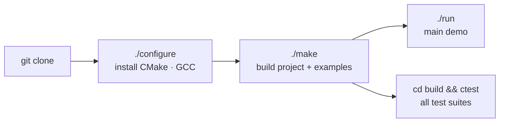

# cpp-config-ini

A C++20 library for type-safe, schema-driven INI configuration files with CLI override support, validation rules, and schema migration.

## Features

- **Type-safe access** — compile-time enforcement via C++20 concepts; `getValue<T>()` returns the exact type you declared
- **INI persistence** — reads and writes standard INI files automatically
- **CLI overrides** — command-line arguments override any config value at runtime
- **Custom types** — register your own types by implementing `fromString()` / `toString()` / `typeName()`
- **Validation rules** — attach constraints (range checks, allowed lists, custom predicates) to any field
- **Schema migration** — version your schema and define field renames or value transformations between versions
- **Volatile fields** — mark fields as CLI-only so they are never persisted to disk

## Requirements

- GCC with C++20 support
- CMake 3.20+
- Ninja build system

The `./configure` script will download and set up CMake and GCC if they are not already present.

## Getting Started


```mermaid
flowchart LR
    A["git clone"] --> B["./configure\ninstall CMake · GCC"]
    B --> C["./make\nbuild project + examples"]
    C --> D["./run\nmain demo"]
    C --> E["cd build && ctest\nall test suites"]
```

```bash
git clone https://github.com/Mr-Tome/cpp-config-ini.git
cd cpp-config-ini
./configure        # install build dependencies (~/.configuration-dependencies/)
./make             # compile the project and all examples
./run              # run the main demo
```

### Running Tests

```bash
cd build && ctest
```

All 10 test suites must pass before submitting changes.

### Cleaning Up

```bash
./configure clean  # remove downloaded dependencies
./make clean       # remove build artifacts
```

## Architecture


```mermaid
flowchart TB
    subgraph User["Your Config Class"]
        UC["struct MyConfig : ConfigReader&lt;MyConfig, INI, CLI&gt;"]
    end

    subgraph Schema["Schema  —  getConfigSections()"]
        S["ConfigSection"] --> I["ConfigItem::make&lt;T&gt;()"]
        I --> V["Validation Rule"]
        I --> CT["Type\n(int · double · string · vector · custom)"]
    end

    subgraph Layers["Persistence Layers"]
        INI["INI Layer"] <-->|"read / write"| File[(".ini file")]
        CLI["CLI Layer"] -->|"parse"| Argv(["argv[]"])
    end

    API["getValue&lt;T&gt;()  ·  setValue&lt;T&gt;()  ·  saveConfig()"]

    UC --> Schema
    UC --> Layers
    Schema --> API
    Layers --> API
```

## Quick Usage

Derive from `ConfigReader`, specify your persistence modes (`INI`, `CLI`, or both), and declare your schema:

```cpp
#include "config_library/config_reader/config_reader.hpp"

struct MyConfig : public ConfigLib::ConfigReader<MyConfig, ConfigLib::INI>
{
    std::string getConfigFilePath() const { return "my_app.ini"; }

    std::vector<ConfigLib::ConfigSection> getConfigSections() const
    {
        return {
            { "Server", {
                ConfigLib::ConfigItem::make<std::string>("host", std::string("localhost"), "Server hostname", nullptr),
                ConfigLib::ConfigItem::make<int>("port", 8080, "Server port", nullptr)
            }}
        };
    }
};

int main()
{
    MyConfig config;
    std::string host = config.getValue<std::string>("Server", "host");
    int port         = config.getValue<int>("Server", "port");
    config.saveConfig();
}
```

On first run, `my_app.ini` is created with defaults. On subsequent runs it is loaded from disk.

### Adding CLI Overrides

Pass both `INI` and `CLI` as template arguments and forward `argc`/`argv`:

```cpp
struct MyConfig : public ConfigLib::ConfigReader<MyConfig, ConfigLib::INI, ConfigLib::CLI>
{
    MyConfig(int argc, char* argv[])
        : ConfigLib::ConfigReader<MyConfig, ConfigLib::INI, ConfigLib::CLI>(argc, argv) {}
    // ...
};
```

Fields can then be overridden at runtime: `./my_app --Server.port=9090`

### Validation Rules

```cpp
static const ValidationRules::BetweenValues between1And65535(1, 65535);

ConfigLib::ConfigItem::make<int>("port", 8080, "Server port", &between1And65535)
```

Built-in rules: `greaterThanZero`, `BetweenValues`. Custom rules implement the `Rule` interface.

### Custom Types

Inherit from `ConfigLib::ConfigType<T>` and implement three static/const methods:

```cpp
struct Color : public ConfigLib::ConfigType<Color>
{
    int r, g, b;
    static const char* typeName() { return "Color"; }
    std::string toString() const { return std::to_string(r)+","+std::to_string(g)+","+std::to_string(b); }
    static Color fromString(const std::string& s) { /* parse */ }
};
```

## Project Structure

```
cpp-config-ini/
├── source/
│   ├── config_library/
│   │   ├── common/          # ConfigSchema, TypeParser, ValidationRules, SchemaEvolver, Logger
│   │   └── config_reader/   # ConfigReader, CLIFeatureLayer, INI/CLI persistence
│   └── main.cpp             # Main demo
├── examples/                # Standalone example programs (each .cpp is its own executable)
├── tests/                   # One .cpp per test suite, custom lightweight framework
├── CMakeLists.txt
├── configure                # Dependency setup script
├── make                     # Build script (wraps CMake + Ninja)
└── run                      # Run script for the main demo
```

## Examples

The `examples/` directory contains standalone programs that are built automatically with `./make`. Each `.cpp` file compiles to its own executable. See `examples/cli_and_ini/color_migration.cpp` for a full schema migration walkthrough.

## Contributing

See [CONTRIBUTING.md](CONTRIBUTING.md).
